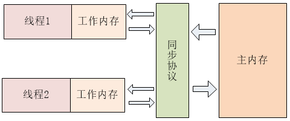
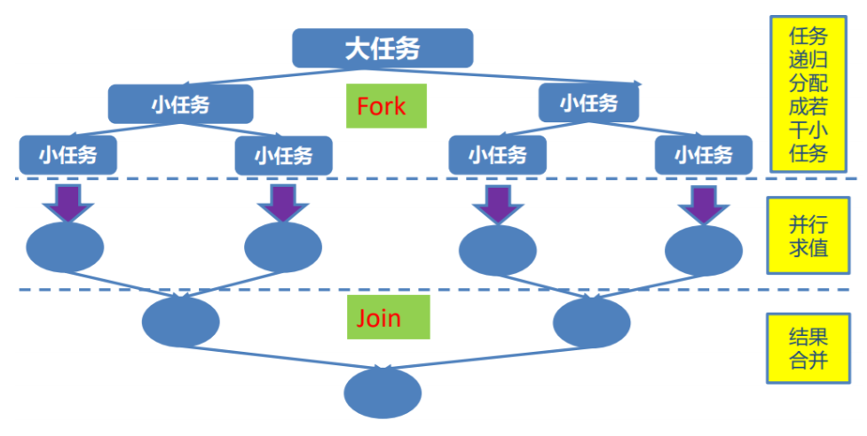

# Java JUC

## 1 Java JUC简介

在 Java 5.0 提供了 **java.util.concurrent** （简称 JUC ）包，在此包中增加了在并发编程中很常用 的实用工具类，用于定义类似于线程的自定义子 系统，包括线程池、异步 IO 和轻量级任务框架。 提供可调的、灵活的线程池。还提供了设计用于多线程上下文中的 Collection 实现等。


----

## 2 volatile 关键字-内存可见性

### 2.1 内存可见性

Java 内存模型规定，**对于多个线程共享的变量，存储在主内存当中**，**每个线程都有自己独立的工作内存，并且线程只能访问自己的工作内存，不可以访问其它线程的工作内存**。**工作内存中保存了主内存中共享变量的副本**，线程要操作这些共享变量，只能通过操作工作内存中的副本来实现，操作完毕之后再同步回到主内存当中，其 JVM 模型大致如下图。




JVM 模型规定：1) 线程对共享变量的所有操作必须在自己的内存中进行，不能直接从主内存中读写; 2) 不同线程之间无法直接访问其它线程工作内存中的变量，线程间变量值的传递需要通过主内存来完成。这样的规定可能导致得到后果是：线程对共享变量的修改没有即时更新到主内存，或者线程没能够即时将共享变量的最新值同步到工作内存中，从而使得线程在使用共享变量的值时，该值并不是最新的。这就引出了内存可见性。

内存可见性（Memory Visibility）是指当某个线程正在使用对象状态，而另一个线程在同时修改该状态，需要确保当一个线程修改了对象状态后，其他线程能够看到发生的状态变化。

可见性错误是指当读操作与写操作在不同的线程中执行时，我们无法确保执行读操作的线程能适时地看到其他线程写入的值，有时甚至是根本不可能的事情。

```java
public class TestVolatile {
	public static void main(String[] args) {
		ThreadDemo td = new ThreadDemo();
		new Thread(td).start();
		
		while(true){
			if(td.isFlag()){
				System.out.println("------------------");
				break;
			}
		}
		
	}
}

class ThreadDemo implements Runnable {

	private boolean flag = false;

	@Override
	public void run() {
		
		try {
			Thread.sleep(200);
		} catch (InterruptedException e) {
		}

		flag = true;
		
		System.out.println("flag=" + isFlag());

	}
	public boolean isFlag() {
		return flag;
	}
	public void setFlag(boolean flag) {
		this.flag = flag;
	}
}
//输出：
//flag=true
```


### 2.2 volatile 关键字

Java 提供了一种稍弱的同步机制，即 volatile 变量，用来确保将变量的更新操作通知到其它线程。当把共享变量声明为 volatile 类型后，**线程对该变量修改时会将该变量的值立即刷新回主内存**，同时会使其它线程中缓存的该变量无效，从而其它线程在读取该值时会从主内中重新读取该值（参考缓存一致性）。因此在读取 volatile 类型的变量时总是会返回最新写入的值。

volatile**屏蔽掉了JVM中必要的代码优化(指令重排序)**，所以在**效率上比较低**

```java
//如果设置为	
private volatile boolean flag = false;
//输出结果：
flag=true
------------------
```

volatile关键字最主要的作用是：

1. **保证变量的内存可见性**
2. **局部阻止重排序的发生**

可以将 volatile 看做一个轻量级的锁，但是又与 锁有些不同： 

1. 对于多线程，**不是一种互斥关系** 
2. **不能保证变量状态的“原子性操作“**


----

## 3 原子变量与CAS算法

### 3.1 原子变量

#### 3.1.1 i++的原子性问题

```java
public class TestAtomicDemo {
	public static void main(String[] args) {
		AtomicDemo ad = new AtomicDemo();
		for (int i = 0; i < 10; i++) {
			new Thread(ad).start();
		}
	}
}
class AtomicDemo implements Runnable{
//	private volatile int serialNumber = 0;
	private AtomicInteger serialNumber = new AtomicInteger(0);
	
	@Override
	public void run() {
		try {
			Thread.sleep(200);
		} catch (InterruptedException e) {
		}
		System.out.print(getSerialNumber()+" ");
	}
	public int getSerialNumber(){
		return serialNumber.getAndIncrement();
	}
}
//运行结果
//1 3 2 0 4 6 5 7 8 9 ——> 不会重复
```

```java
//如果改为：
class AtomicDemo implements Runnable{
	private volatile int serialNumber = 0;
//	private AtomicInteger serialNumber = new AtomicInteger(0);
	
	@Override
	public void run() {
		try {
			Thread.sleep(200);
		} catch (InterruptedException e) {
		}
		System.out.print(getSerialNumber()+" ");
	}
	public int getSerialNumber(){
		return serialNumber++;
//		return serialNumber.getAndIncrement();
	}
}
//运行结果：
//0 4 3 2 1 0 5 6 7 8 ——> 会产生重复
```


#### 3.1.2 原子变量

实现全局自增id最简单有效的方式是什么？`java.util.concurrent.atomic`包定义了一些常见类型的原子变量。这些原子变量为我们提供了一种操作单一变量无锁(*lock-free*)的线程安全(*thread-safe*)方式。

实际上该包下面的类为我们提供了类似`volatile`变量的特性，同时还提供了诸如`boolean compareAndSet(expectedValue, updateValue)`的功能。

不使用锁实现线程安全听起来似乎很不可思议，这其实是通过CPU的`compare and swap`指令实现的，由于硬件指令支持当然不需要加锁了。

> 核心方法：**boolean compareAndSet(expectedValue, updateValue)**

- 原子变量类的命名类似于AtomicXxx，例如，AtomicInteger类用于表示一个int变量。

- 标量原子变量类

  AtomicInteger，AtomicLong和AtomicBoolean类分别支持对原始数据类型int，long和boolean的操作。

  当引用变量需要以原子方式更新时，AtomicReference类用于处理引用数据类型。

- 原子数组类

  有三个类称为AtomicIntegerArray，AtomicLongArray和AtomicReferenceArray，它们表示一个int，long和引用类型的数组，其元素可以进行原子性更新。


### 3.2 CAS算法

* Compare And Swap (Compare And Exchange) / 自旋 / 自旋锁 / 无锁 

* CAS 是一种**硬件对并发的支持**，针对多处理器操作而设计的处理器中的一种特殊指令，用于管理对共享数据的并发访问。 

* CAS 是一种**无锁的非阻塞算法**的实现。 

* CAS 包含了 3 个操作数： 

  * 需要读写的内存值 V
  * 进行比较的值 A
  * 拟写入的新值 B

  当且仅当 **V 的值等于 A** 时，CAS 通过原子方式用新值 B 来更新 V的值，否则不会执行任何操作。


#### 3.2.1 ABA问题

CAS会导致ABA问题，线程1准备用CAS将变量的值由A替换为B，在此之前，线程2将变量的值由A替换为C，又由C替换为A，然后线程1执行CAS时发现变量的值仍然为A，所以CAS成功。但实际上这时的现场已经和最初不同了，尽管CAS成功，但可能存在潜藏的问题。

解决办法（版本号 AtomicStampedReference），基础类型简单值不需要版本号


#### 3.2.2 CAS在JAVA中底层的实现

**Unsafe**

Unsafe类：Java 与 C/C++ 的一个非常明显区别就是，Java 中不可以直接操作内存。当然这并不完全正确，因为 Unsafe 就可以做到。

Unsafe在AtomicInteger中的应用:

```java
class AtomicDemo implements Runnable{
	private AtomicInteger serialNumber = new AtomicInteger(0);
	
	@Override
	public void run() {
		try {
			Thread.sleep(200);
		} catch (InterruptedException e) {
		}
		System.out.print(getSerialNumber()+" ");
	}
	public int getSerialNumber(){
		return serialNumber.incrementAndGet();
	}
}
```


```java
public final int incrementAndGet() {
        for (;;) {
            int current = get();
            int next = current + 1;
            if (compareAndSet(current, next))
                return next;
        }
    }

public final boolean compareAndSet(int expect, int update) {
        return unsafe.compareAndSwapInt(this, valueOffset, expect, update);
    }
```

Unsafe:

```java
public final native boolean compareAndSwapInt(Object var1, long var2, int var4, int var5);
```

运用：

```java
package com.mashibing.jol;

import sun.misc.Unsafe;

import java.lang.reflect.Field;

public class T02_TestUnsafe {

    int i = 0;
    private static T02_TestUnsafe t = new T02_TestUnsafe();

    public static void main(String[] args) throws Exception {
        //Unsafe unsafe = Unsafe.getUnsafe();

        Field unsafeField = Unsafe.class.getDeclaredFields()[0];
        unsafeField.setAccessible(true);
        Unsafe unsafe = (Unsafe) unsafeField.get(null);

        Field f = T02_TestUnsafe.class.getDeclaredField("i");
        long offset = unsafe.objectFieldOffset(f);
        System.out.println(offset);

        boolean success = unsafe.compareAndSwapInt(t, offset, 0, 1);
        System.out.println(success);
        System.out.println(t.i);
        //unsafe.compareAndSwapInt()
    }
}
```

jdk8u: unsafe.cpp:

cmpxchg = compare and exchange

```c++
UNSAFE_ENTRY(jboolean, Unsafe_CompareAndSwapInt(JNIEnv *env, jobject unsafe, jobject obj, jlong offset, jint e, jint x))
  UnsafeWrapper("Unsafe_CompareAndSwapInt");
  oop p = JNIHandles::resolve(obj);
  jint* addr = (jint *) index_oop_from_field_offset_long(p, offset);
  return (jint)(Atomic::cmpxchg(x, addr, e)) == e;
UNSAFE_END
```

jdk8u: atomic_linux_x86.inline.hpp

is_MP = Multi Processor  

```c++
inline jint     Atomic::cmpxchg    (jint     exchange_value, volatile jint*     dest, jint     compare_value) {
  int mp = os::is_MP();
  __asm__ volatile (LOCK_IF_MP(%4) "cmpxchgl %1,(%3)"
                    : "=a" (exchange_value)
                    : "r" (exchange_value), "a" (compare_value), "r" (dest), "r" (mp)
                    : "cc", "memory");
  return exchange_value;
}
```

jdk8u: os.hpp is_MP()

```c++
  static inline bool is_MP() {
    // During bootstrap if _processor_count is not yet initialized
    // we claim to be MP as that is safest. If any platform has a
    // stub generator that might be triggered in this phase and for
    // which being declared MP when in fact not, is a problem - then
    // the bootstrap routine for the stub generator needs to check
    // the processor count directly and leave the bootstrap routine
    // in place until called after initialization has ocurred.
    return (_processor_count != 1) || AssumeMP;
  }
```

jdk8u: atomic_linux_x86.inline.hpp

```c++
#define LOCK_IF_MP(mp) "cmp $0, " #mp "; je 1f; lock; 1: "
```

最终实现：

**cmpxchg** = cas修改变量值     

```java
lock cmpxchg 指令   //记住这条指令
```

**cmpxchg不能保证原子性，lock保证了原子性**（当执行cmpxchg指令时，其他CPU不允许对里面的值进行修改）。

硬件：

lock指令在执行后面指令的时候锁定一个北桥信号（电信号）

（不采用锁总线的方式）

> ### <b style="color:blue;font-size:30px">CAS在JAVA中底层的实现是通过 lock cmpxchg来实现的</b>
>
> ### volatile和synchronized的实现也都跟这条指令有关


### 3.3 原子性与可见性区别


----


## 4 ConcurrentHashMap

ConcurrentHashMap 同步容器类是Java 5 增加的一个线程安全的哈希表。对于多线程的操作，介于 HashMap 与 Hashtable 之间。**内部采用“锁分段” 机制替代 Hashtable 的独占锁**，进而提高性能。


#### 4.1 锁粒度

**减小锁粒度是指缩小锁定对象的范围**，从而减小锁冲突的可能性，从而提高系统的并发能力。减小锁粒度是一种削弱多线程锁竞争的有效手段，这种技术典型的应用是 ConcurrentHashMap(高性能的HashMap)类的实现。对于 HashMap 而言，最重要的两个方法是 get 与 set 方法，如果我们对整个 HashMap 加锁，可以得到线程安全的对象，但是加锁粒度太大。Segment 的大小也被称为 ConcurrentHashMap 的并发度。


#### 4.2 锁分段

ConcurrentHashMap，它内部细分了若干个小的 HashMap，称之为段(Segment)。默认情况下 一个 ConcurrentHashMap 被进一步细分为 16 个段，既就是锁的并发度。

如果需要在 ConcurrentHashMap 中添加一个新的表项，并不是将整个 HashMap 加锁，而是首 先根据 hashcode 得到该表项应该存放在哪个段中，然后对该段加锁，并完成 put 操作。在多线程 环境中，如果多个线程同时进行put操作，只要被加入的表项不存放在同一个段中，则线程间可以做到真正的并行。


#### 4.3 其它

此包还提供了设计用于多线程上下文中的 Collection 实现： 

ConcurrentHashMap、ConcurrentSkipListMap、ConcurrentSkipListSet、 CopyOnWriteArrayList 和 CopyOnWriteArraySet。

* 当期望许多线程访问一个给定 collection 时，ConcurrentHashMap 通常优于同步的 HashMap， ConcurrentSkipListMap 通常优于同步的 TreeMap。

* 当期望的读数和遍历远远 大于列表的更新数时，CopyOnWriteArrayList 优于同步的 ArrayList。


#### 4.4 写入并复制

注意：添加操作多时，效率低，因为每次添加时都会进行复制，开销非常的大。并发迭代操作多时可以选择。

```java
public class TestCopyOnWriteArrayList {

	public static void main(String[] args) {
		HelloThread ht = new HelloThread();
		
		for (int i = 0; i < 10; i++) {
			new Thread(ht).start();
		}
	}
}

class HelloThread implements Runnable{
	
	private static List<String> list = Collections.synchronizedList(new ArrayList<String>());
//	private static CopyOnWriteArrayList<String> list = new CopyOnWriteArrayList<>();
	static{
		list.add("AA");
		list.add("BB");
		list.add("CC");
	}
	@Override
	public void run() {
		Iterator<String> it = list.iterator();		
		while(it.hasNext()){
			System.out.println(it.next());
			list.add("AA");
		}
	}
}
```

运行会造成并发修改异常`ConcurrentModificationException`。遍历的列表和添加的都是同一个。


```java
//	private static List<String> list = Collections.synchronizedList(new ArrayList<String>());
	private static CopyOnWriteArrayList<String> list = new CopyOnWriteArrayList<>();
```

这样不会报错，正常运行。**因为在每次写入时，都会在底层完成一次复制，复制一份新的列表，然后再进行添加。每次写入都会复制。**不会造成并发修改异常，但是效率较低。

**添加操作多时，效率低，因为每次添加时都会进行复制，开销非常的大。并发迭代操作多时可以选择。**


----

## 5 CountDownLatch(闭锁)

#### 5.1 概念

CountDownLatch（闭锁）——一个同步辅助类，在完成一组正在其他线程中执行的操作之前，它允许一个或多个线程一直等待。CountDown（倒数）latch（锁）

用给定的计数 初始化 CountDownLatch。由于调用了 countDown() 方法，所以在当前计数到达零之前，await 方法会一直受阻塞。之后，会释放所有等待的线程，await 的所有后续调用都将立即返回。这种现象只出现一次——计数无法被重置。 **一个线程(或者多个)， 等待另外N个线程完成某个事情之后才能执行。**

闭锁可以延迟线程的进度直到其到达终止状态，闭锁可以用来确保某些活 动直到其他活动都完成才继续执行： 

* 确保某个计算在其需要的所有资源都被初始化之后才继续执行; 
* 确保某个服务在其依赖的所有其他服务都已经启动之后才启动; 
* 等待直到某个操作所有参与者都准备就绪再继续执行。


#### 5.2 方法介绍

**CountDownLatch最重要的方法是<u>countDown()</u>——倒数 和 <u>await()</u>，前者主要是倒数一次，后者是等待倒数到0，如果没有到达0，就只有阻塞等待了。**

```java
public class TestCountDownLatch {

	public static void main(String[] args) {
		final CountDownLatch latch = new CountDownLatch(50);  //每次有个线程执行完-1，设置初始值50
		LatchDemo ld = new LatchDemo(latch);

		long start = System.currentTimeMillis();
        
		for (int i = 0; i < 50; i++) {
			new Thread(ld).start();
		}

		try {
			latch.await();   //50个线程执行完，才继续执行main线程
		} catch (InterruptedException e) {
		}
        
		long end = System.currentTimeMillis();
		System.out.println("耗费时间为：" + (end - start));
	}
}

class LatchDemo implements Runnable {
    
	private CountDownLatch latch;
	public LatchDemo(CountDownLatch latch) {
		this.latch = latch;
	}
    
	@Override
	public void run() {
		try {
			for (int i = 0; i < 50000; i++) {
				if (i % 2 == 0) {
					System.out.println(i);
				}
			}
		} finally {
			latch.countDown();    //每次执行完-1，放在finally里确保每次都执行
		}
	}
}
```


----

## 6 实现 Callable 接口

Java 5.0 在 java.util.concurrent 提供了一个**新的创建执行线程的方式：Callable 接口**。

Callable 需要依赖FutureTask ，FutureTask 也可以用作闭 锁。


### 6.1 创建线程的四种方式

无返回：

1. 实现Runnable接口，重写run(); 
2. 继承Thread类，重写run(); 

有返回：

1. 实现Callable接口，重写call(),利用FutureTask包装Callable，并作为task传入Thread构造函数；
2. 利用线程池；


### 6.2 Callable的使用

```java
public class TestCallable {
	
	public static void main(String[] args) {
		ThreadDemo td = new ThreadDemo();
		
		//1.执行 Callable 方式，需要 FutureTask 实现类的支持，用于接收运算结果。
		FutureTask<Integer> result = new FutureTask<>(td);
		
		new Thread(result).start();
		
		//2.接收线程运算后的结果
		try {
			Integer sum = result.get();  //FutureTask 可用于 闭锁
			System.out.println(sum);
			System.out.println("------------------------------------");
		} catch (InterruptedException | ExecutionException e) {
			e.printStackTrace();
		}
	}
}

class ThreadDemo implements Callable<Integer>{
	@Override
	public Integer call() throws Exception {
		int sum = 0;
		for (int i = 0; i <= 100000; i++) {
			sum += i;
		}
		return sum;
	}
}
```


----

## 7 -Lock 同步锁

在 Java 5.0 之前，协调共享对象的访问时可以使用的机制只有 synchronized 和 volatile 。Java 5.0 后增加了一些新的机制，但并不是一种替代内置锁的方法，而是当内 置锁不适用时，作为一种可选择的高级功能。

ReentrantLock 实现了 Lock 接口，并提供了与 synchronized 相同的互斥性和内存可见性。但相较于 synchronized 提供了更高的处理锁的灵活性。


解决多线程安全问题的三种方式

* jdk 1.5 前：
  * synchronized：隐式锁

    1.同步代码块

    2.同步方法

* jdk 1.5 后：

  * 3.同步锁 Lock：显式锁

    注意：是一个显示锁，需要通过 lock() 方法上锁，必须通过 unlock() 方法进行释放锁

```java
public class TestLock {
	
	public static void main(String[] args) {
		Ticket ticket = new Ticket();
		
		new Thread(ticket, "1号窗口").start();
		new Thread(ticket, "2号窗口").start();
		new Thread(ticket, "3号窗口").start();
	}

}

class Ticket implements Runnable{
	
	private int tick = 100;
	
	private Lock lock = new ReentrantLock();

	@Override
	public void run() {
		while(true){
			
			lock.lock(); //上锁
			
			try{
				if(tick > 0){
					try {
						Thread.sleep(200);
					} catch (InterruptedException e) {
					}
					
					System.out.println(Thread.currentThread().getName() + " 完成售票，余票为：" + --tick);
				}
			}finally{
				lock.unlock(); //必须执行 因此放在finally中 释放锁
			}
		}
	}
	
}
```


----

## 8 Condition 控制线程通信

Condition 接口描述了可能会与锁有关联的条件变量。这些变量在用 法上与使用 Object.wait 访问的隐式监视器类似，但提供了更强大的功能。需要特别指出的是，单个 Lock 可能与多个 Condition 对象关联。为了避免兼容性问题，Condition 方法的名称与对应的 Object 版本中的不同。 

在 Condition 对象中，**与 wait、notify 和 notifyAll 方法对应的分别是 await、signal 和 signalAll**。 

Condition 实例实质上被绑定到一个锁上。要为特定 Lock 实例获得 Condition 实例，请使用其 newCondition() 方法。


### 8.1 使用Condition

使用Condition控制线程通信： 

1. 如果不使用synchronized关键字保证同步，而是直接使用Lock对象来保证同步，则**系统中不存在隐式的同步监视器**，也就不能使用wait() notify() notifyAll()来进行线程通信了 
2. 当使用lock对象来保证同步时，Java提供了一个Condition类来保持协调，使用Condition可以让那些已经得到lock对象却无法继续执行的线程释放lock对象，Condition对象也可以唤醒其他处于等待状态的进程。 
3. Condition实例被绑定在一个Lock对象上。要获得Lock实例的Condition实例，调用Lock对象的newCondition()方法即可。


### 8.2 生产者和消费者案例

```
public class TestProductorAndConsumerForLock {

	public static void main(String[] args) {
		Clerk clerk = new Clerk();

		Productor pro = new Productor(clerk);
		Consumer con = new Consumer(clerk);

		new Thread(pro, "生产者 A").start();
		new Thread(con, "消费者 B").start();

//		 new Thread(pro, "生产者 C").start();
//		 new Thread(con, "消费者 D").start();
	}

}

class Clerk {
	private int product = 0;

	private Lock lock = new ReentrantLock();  //创建lock对象
	private Condition condition = lock.newCondition();  //获得Lock实例的Condition实例
	// 进货
	public void get() {
		lock.lock();

		try {
			if (product >= 1) { // 为了避免虚假唤醒，应该总是使用在循环中。
				System.out.println("产品已满！");
				try {
					condition.await();
				} catch (InterruptedException e) {
				}

			}
			System.out.println(Thread.currentThread().getName() + " : " + ++product);

			condition.signalAll();
		} finally {
			lock.unlock();
		}

	}

	//售货
	public void sale() {
		lock.lock();
		try {
			if (product <= 0) {
				System.out.println("缺货！");

				try {
					condition.await();
				} catch (InterruptedException e) {
				}
			}

			System.out.println(Thread.currentThread().getName() + " : " + --product);

			condition.signalAll();

		} finally {
			lock.unlock();
		}
	}
}

// 生产者
class Productor implements Runnable {

	private Clerk clerk;

	public Productor(Clerk clerk) {
		this.clerk = clerk;
	}

	@Override
	public void run() {
		for (int i = 0; i < 20; i++) {
			try {
				Thread.sleep(200);
			} catch (InterruptedException e) {
				e.printStackTrace();
			}
			clerk.get();   //调用店员进货方法
		}
	}
}

// 消费者
class Consumer implements Runnable {

	private Clerk clerk;

	public Consumer(Clerk clerk) {
		this.clerk = clerk;
	}

	@Override
	public void run() {
		for (int i = 0; i < 20; i++) {
			clerk.sale();	//调用店员售货方法
		}
	}

}
```


----

## 9 线程按序交替

要求：编写一个程序，开启 3 个线程，这三个线程的 ID 分别为 A、B、C，每个线程将自己的 ID 在屏幕上打印 10 遍，要 求输出的结果必须按顺序显示。 如：ABCABCABC…… 依次递归

```java
public class TestABCAlternate {
	
	public static void main(String[] args) {
		AlternateDemo ad = new AlternateDemo();
		
		new Thread(new Runnable() {
			@Override
			public void run() {
				
				for (int i = 1; i <= 20; i++) {
					ad.loopA(i);
				}
				
			}
		}, "A").start();
		
		new Thread(new Runnable() {
			@Override
			public void run() {
				
				for (int i = 1; i <= 20; i++) {
					ad.loopB(i);
				}
				
			}
		}, "B").start();
		
		new Thread(new Runnable() {
			@Override
			public void run() {
				
				for (int i = 1; i <= 20; i++) {
					ad.loopC(i);
					
					System.out.println("-----------------------------------");
				}
				
			}
		}, "C").start();
	}

}

class AlternateDemo{
	
	private int number = 1; //当前正在执行线程的标记
	
	private Lock lock = new ReentrantLock();
	private Condition condition1 = lock.newCondition();
	private Condition condition2 = lock.newCondition();
	private Condition condition3 = lock.newCondition();
	
	/**
	 * @param totalLoop : 循环第几轮
	 */
	public void loopA(int totalLoop){
		lock.lock();
		
		try {
			//1. 判断
			if(number != 1){
				condition1.await();   //线程A等待
			}
			
			//2. 打印
			for (int i = 1; i <= 1; i++) {
				System.out.println(Thread.currentThread().getName() + "\t" + i + "\t" + totalLoop);
			}
			
			//3. 唤醒
			number = 2;
			condition2.signal();  //唤醒B线程
		} catch (Exception e) {
			e.printStackTrace();
		} finally {
			lock.unlock();
		}
	}
	
	public void loopB(int totalLoop){
		lock.lock();
		
		try {
			//1. 判断
			if(number != 2){
				condition2.await();		//线程B等待
			}
			
			//2. 打印
			for (int i = 1; i <= 1; i++) {
				System.out.println(Thread.currentThread().getName() + "\t" + i + "\t" + totalLoop);
			}
			
			//3. 唤醒
			number = 3;
			condition3.signal();		//唤醒C线程
		} catch (Exception e) {
			e.printStackTrace();
		} finally {
			lock.unlock();
		}
	}
	
	public void loopC(int totalLoop){
		lock.lock();
		
		try {
			//1. 判断
			if(number != 3){
				condition3.await();		//C线程等待
			}
			
			//2. 打印
			for (int i = 1; i <= 1; i++) {
				System.out.println(Thread.currentThread().getName() + "\t" + i + "\t" + totalLoop);
			}
			
			//3. 唤醒
			number = 1;
			condition1.signal();		//唤醒A线程
		} catch (Exception e) {
			e.printStackTrace();
		} finally {
			lock.unlock();
		}
	}
	
}
```


----

## 10 ReadWriteLock 读写锁

ReadWriteLock 维护了一对相关的锁，**一个用于只读操作， 另一个用于写入操作**。只要没有 writer，读取锁可以由多个 reader 线程同时保持。写入锁是独占的。 

ReadWriteLock **读取操作通常不会改变共享资源，但执行写入操作时，必须独占方式来获取锁**。对于读取操作占多数的数据结构。 ReadWriteLock 能提供比独占锁更高的并发性。而对于只读的数据结构，其中包含的不变性 可以完全不需要考虑加锁操作。

* 写写/读写 需要“互斥”
* 读读 不需要互斥

```java
public class TestReadWriteLock {

	public static void main(String[] args) {
		ReadWriteLockDemo rw = new ReadWriteLockDemo();
		
		new Thread(new Runnable() {
			
			@Override
			public void run() {
				rw.set((int)(Math.random() * 101));
			}
		}, "Write:").start();
		
		
		for (int i = 0; i < 100; i++) {
			new Thread(new Runnable() {
				
				@Override
				public void run() {
					rw.get();
				}
			}).start();
		}
	}
	
}

class ReadWriteLockDemo{
	
	private int number = 0;
	
	private ReadWriteLock lock = new ReentrantReadWriteLock();
	
	//读
	public void get(){
		lock.readLock().lock(); //上锁
		
		try{
			System.out.println(Thread.currentThread().getName() + " : " + number);
		}finally{
			lock.readLock().unlock(); //释放锁
		}
	}
	
	//写
	public void set(int number){
		lock.writeLock().lock();
		
		try{
			System.out.println(Thread.currentThread().getName());
			this.number = number;
		}finally{
			lock.writeLock().unlock();
		}
	}
}
```


----

## 11 线程8锁

判断打印的 "one" or "two" ？

 * 1. 两个普通同步方法，两个线程，标准打印， 打印结果?
 * 2. 新增 Thread.sleep() 给 getOne()，打印结果? 
 * 3. 新增普通方法 getThree() , 打印结果? 
 * 4. 两个普通同步方法，两个 Number 对象，打印结果?
 * 5. 修改 getOne() 为静态同步方法，打印结果? 
 * 6. 修改两个方法均为静态同步方法，一个 Number 对象，打印结果?  
 * 7. 一个静态同步方法，一个非静态同步方法，两个 Number 对象，打印结果?  
 * 8. 两个静态同步方法，两个 Number 对象，打印结果?   

要想知道上面线程8锁的答案，需要知晓关键所在：

* ① 非静态方法的锁默认为  this（实例对象）,  静态方法的锁为对应的 Class 对象（类对象）。
 * ② 某一个时刻，同一个对象，只能有一个线程持有锁，无论几个方法。
 * ③ 锁静态方法，某一个时刻，不同实例对象也只能有一个对象持有锁。

```java
public class TestThread8Monitor {
	
	public static void main(String[] args) {
		Number number = new Number();
		Number number2 = new Number();
		
		new Thread(new Runnable() {
			@Override
			public void run() {
				number.getOne();
			} 
		}).start();
		
		new Thread(new Runnable() {
			@Override
			public void run() {
//				number.getTwo();
				number2.getTwo();
			}
		}).start();
		
//		new Thread(new Runnable() {
//			@Override
//			public void run() {
//				number.getThree();
//			}
//		}).start();
		
	}

}

class Number{
	
	public static synchronized void getOne(){
		try {
			Thread.sleep(3000);
            System.out.println("--过了3秒--");
		} catch (InterruptedException e) {
		}
		
		System.out.println("one");
	}
	
	public static synchronized void getTwo(){
		System.out.println("two");
	}
	
	public void getThree(){
		System.out.println("three");
	}
	
}
```

答案：

 1. 两个普通同步方法，两个线程，一个 Number 对象，标准打印， 打印结果? //one  two
 2. 新增 Thread.sleep() 给 getOne() ,打印结果? // --过了3秒--  one   two
 3. 新增普通方法 getThree() , 打印结果? //three  --过了3秒--  one   two
 4. 两个普通同步方法，两个 Number 对象，打印结果?  //two  --过了3秒--  one
 5. 修改 getOne() 为静态同步方法，打印结果?  //two  --过了3秒--   one
 6. 修改两个方法均为静态同步方法，一个 Number 对象，打印结果?  //--过了3秒--   one   two
 7. 一个静态同步方法，一个非静态同步方法，两个 Number 对象，打印结果?  //two  --过了3秒--  one
 8. 两个静态同步方法，两个 Number 对象，打印结果?   //--过了3秒--  one  two


----

## 12 线程池

### 12.1 线程池介绍

**第四种获取线程的方法：线程池**。线程池提供了一个线程队列，队列中保存着所有等待状态的线程。避免了创建与销毁额外开销，提高了响应的速度。**通常使用 Executors 工厂方法配置**。

线程池可以解决两个不同问题：由于减少了每个任务调用的开销，它们通常可以在执行大量异步任务时提供增强的性能，并且还可以提供绑定和管理资源（包括执行任务集时使用的线程）的方法。


### 12.2 线程池的体系结构

```java
/*
 * java.util.concurrent.Executor : 负责线程的使用与调度的根接口
 *    |--ExecutorService 子接口: 线程池的主要接口
 *       |--ThreadPoolExecutor 线程池的实现类
 *       |--ScheduledExecutorService 子接口：负责线程的调度
 *          |--ScheduledThreadPoolExecutor ：继承 ThreadPoolExecutor， 实现 ScheduledExecutorService
 */
```


### 12.3 工具类 : Executors 

为了便于跨大量上下文使用，此类提供了很多可调整的参数和扩展钩子 (hook)。但是，强烈建议程序员使用较为方便的 Executors 工厂方法 ： 

* Executors	newCachedThreadPool()（缓存线程池，线程池的数量不固定，可以根据需求自动的更改数量，可以进行自动线程回收） 

* Executors	newFixedThreadPool(int)（创建固定大小的线程池） 

* Executors	newSingleThreadExecutor()（线程池中只有一个线程） 
* ScheduledExecutorService newScheduledThreadPool() : 创建固定大小的线程，可以延迟或定时的执行任务。

```java
public class TestThreadPool {
	
	public static void main(String[] args) throws Exception {
		//1. 创建线程池
		ExecutorService pool = Executors.newFixedThreadPool(5);
		
		List<Future<Integer>> list = new ArrayList<>();
		
		for (int i = 0; i < 10; i++) {
			Future<Integer> future = pool.submit(new Callable<Integer>(){

				@Override
				public Integer call() throws Exception {
					int sum = 0;
					
					for (int i = 0; i <= 100; i++) {
						sum += i;
					}
					return sum;
				}
				
			});

			list.add(future);
		}
		
		pool.shutdown();
		
		for (Future<Integer> future : list) {
			System.out.println(future.get());
		}
		
		
		/*ThreadPoolDemo tpd = new ThreadPoolDemo();
		
		//2. 为线程池中的线程分配任务
		for (int i = 0; i < 10; i++) {
			pool.submit(tpd);
		}
		
		//3. 关闭线程池
		pool.shutdown();*/
	}
	
//	new Thread(tpd).start();
//	new Thread(tpd).start();
}

//class ThreadPoolDemo implements Runnable{
//
//	private int i = 0;
//	
//	@Override
//	public void run() {
//		while(i <= 100){
//			System.out.println(Thread.currentThread().getName() + " : " + i++);
//		}
//	}
//	
//}
```


### 12.4 线程调度

* ScheduledExecutorService newScheduledThreadPool() : 创建固定大小的线程，可以<u>延迟或定时的执行任务</u>。

```java
public class TestScheduledThreadPool {

	public static void main(String[] args) throws Exception {
		ScheduledExecutorService pool = Executors.newScheduledThreadPool(5);
		
		for (int i = 0; i < 5; i++) {
			Future<Integer> result = pool.schedule(new Callable<Integer>(){

				@Override
				public Integer call() throws Exception {
					int num = new Random().nextInt(100);//生成随机数
					System.out.println(Thread.currentThread().getName() + " : " + num);
					return num;
				}
				
			}, 1, TimeUnit.SECONDS);   //延迟线程，延迟时间，时间单位
			
			System.out.println(result.get());
		}
		
		pool.shutdown();
	}
	
}
```


----

## 13 ForkJoinPool 分支/合并框架 工作窃取

### 13.1 Fork/Join 框架

Fork/Join 框架：就是在必要的情况下，将一个大任务，进行拆分(fork)成 若干个小任务（拆到不可再拆时），再将一个个的小任务运算的结果进 行 join 汇总。




### 13.2 Fork/Join 框架与线程池的区别

采用 “工作窃取”模式（work-stealing）： 

当执行新的任务时它可以将其拆分分成更小的任务执行，并将小任务加到线程队列中，然后再**从一个随机线程的队列中偷一个并把它放在自己的队列中**。 

相对于一般的线程池实现，fork/join框架的优势体现在对其中包含的任务的处理方式上。在一般的线程池中，如果一个线程正在执行的任务由于某些原因无法继续运行，那么该线程会处于等待状态。而在fork/join框架实现中， 如果某个子问题由于等待另外一个子问题的完成而无法继续运行。那么处理该子问题的线程会主动寻找其他尚未运行的子问题来执行。这种方式减少了 线程的等待时间，提高了性能。

```java
public class TestForkJoinPool {
	
	public static void main(String[] args) {
		Instant start = Instant.now();
		
		ForkJoinPool pool = new ForkJoinPool();
		
		ForkJoinTask<Long> task = new ForkJoinSumCalculate(0L, 5000000000L);
		
		Long sum = pool.invoke(task);
		
		System.out.println(sum);
		
		Instant end = Instant.now();
		
		System.out.println("耗费时间为：" + Duration.between(start, end).toMillis());//2709  拆分也需要时间
	}
	
	@Test
	public void test1(){
		Instant start = Instant.now();
		
		long sum = 0L;
		
		for (long i = 0L; i <= 5000000000L; i++) {
			sum += i;
		}
		
		System.out.println(sum);
		
		Instant end = Instant.now();
		
		System.out.println("for耗费时间为：" + Duration.between(start, end).toMillis());//2057
	}
	
	//java8 新特性
	@Test
	public void test2(){
		Instant start = Instant.now();
		
		Long sum = LongStream.rangeClosed(0L, 5000000000L)
							 .parallel()
							 .reduce(0L, Long::sum);
		
		System.out.println(sum);
		Instant end = Instant.now();
		System.out.println("java8 新特性耗费时间为：" + Duration.between(start, end).toMillis());//1607
	}
}

class ForkJoinSumCalculate extends RecursiveTask<Long>{

	/**
	 * 
	 */
	private static final long serialVersionUID = -259195479995561737L;
	private long start;
	private long end;
	private static final long THURSHOLD = 10000L;  //临界值
	
	public ForkJoinSumCalculate(long start, long end) {
		this.start = start;
		this.end = end;
	}

	@Override
	protected Long compute() {
		long length = end - start;
		
		if(length <= THURSHOLD){
			long sum = 0L;
			
			for (long i = start; i <= end; i++) {
				sum += i;
			}
			
			return sum;
		}else{
			long middle = (start + end) / 2;
			
			ForkJoinSumCalculate left = new ForkJoinSumCalculate(start, middle); 
			left.fork(); //进行拆分，同时压入线程队列
			
			ForkJoinSumCalculate right = new ForkJoinSumCalculate(middle+1, end);
			right.fork(); //进行拆分，同时压入线程队列
			
			return left.join() + right.join();
		}
	}
	
}
```

